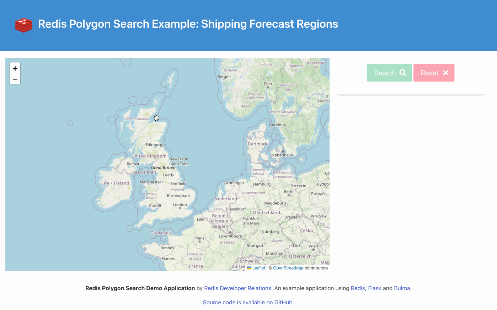

# Redis Stack Polygon Search Weather Demo



Watch the recording of our Polygon Search live stream video on YouTube [here](https://www.youtube.com/watch?v=CegTSglMUks).  Note that the code has been tidied up a little since this was recorded -- it no longer uses redis-py's `execute_command` when performing search queries: it uses the more idiomatic interface instead.

## Introduction

This repository is a small self-contained demonstration of the Polygon Search functionality that was added in the 7.2 release of Redis Stack.

For information about this release and the other new features in it, check out the [blog post](https://redis.com/blog/introducing-redis-7-2/).

Using data for the 31 regions of the British [Shipping Forecast](https://www.metoffice.gov.uk/weather/specialist-forecasts/coast-and-sea/shipping-forecast), we'll look at how to use the Search capability of Redis Stack to find which shipping forecast regions fall within an area described by a polygon, and also which shipping forecast region any given point around the British Isles belongs to.

This example uses the real Shipping Forecast regions, along with fixed text data for each that describes the four components of a forecast:

* Wind
* Sea State
* Weather
* Visibility

Check out the [Shipping Forecast on Wikipedia](https://en.wikipedia.org/wiki/Shipping_Forecast) for more information about this unique maritime weather broadcast.

## Prerequisites

You'll need to have the following installed:

* [Python](https://www.python.org/) - version 3.10 or higher.  We've tested this with Python 3.10.7.
* [Docker Desktop](https://www.docker.com/products/docker-desktop/).
* [Git command line tools](https://git-scm.com/downloads) to clone the repository (or if you don't have these, you can get a .zip file from GitHub instead).
* A browser (we've tested this with [Google Chrome](https://www.google.com/chrome/)).
* Optional but recommended: [RedisInsight](https://redis.io/docs/ui/insight/) - a graphical tool for viewing and managing data in Redis.

## Running the Demo

To run the demo, you'll need to clone the repository from GitHub, create a Python virtual environment then install the dependencies and start a Redis Stack instance.  We've provided a Docker Compose file for Redis Stack.  

Begin by cloning the repository from GitHub:

```
git clone https://github.com/redis-developer/redis-polygon-search-weather-demo.git
cd redis-polygon-search-weather-demo
```

Enter the following commands to create the virtual environment and install dependencies:

```
python3 -m venv venv
. ./venv/bin/activate
pip install -r requirements.txt
```

Now, start Redis Stack:

```
docker-compose up -d
```

We're using a `.env` file to store secrets such as the host and port that Redis runs on.  An example environment file `example.env` is included in this repository.

If you're using Redis Stack with the Docker Compose provided, you won't need to change any values, and can just copy `env.example` to `.env`:

```
cp env.example .env
```

If you need to change the Redis connection details (for example because your Redis Stack instance runs remotely or uses a password, or you want to change the port that the backend server runs on), edit `.env` accordingly before proceeding further.

The next step is to load the data into Redis Stack:

```
python data_loader.py --load data/shipping_forecast_regions.json
```

You should see output similar to this:

```
Checking for previous index and dropping if found.
Creating index.
Stored region:bailey (Bailey)
Stored region:biscay (Biscay)
Stored region:cromarty (Cromarty)
Stored region:dogger (Dogger)
...
Stored region:wight (Wight)
Regions loaded: 31
Done!
```

Start the Flask server application:

```
flask run
```

You should see output similar to this:

```
 * Debug mode: on
WARNING: This is a development server. Do not use it in a production deployment. Use a production WSGI server instead.
 * Running on http://127.0.0.1:5000
Press CTRL+C to quit
 * Restarting with stat
 * Debugger is active!
 * Debugger PIN: 253-334-353
```

Point your browser at `http://localhost:5000` - you'll see a map of the United Kingdom.  

You can now either:

* Click once on the map in the sea around the UK, then click the "Search" button.  This will search for the weather region that contains your marker and add it to the map.  Hover over the region polygon to see details for that region.
* Click at least three times (or as many more as you like) anywhere on the map.  After you drop your third marker, a search area polygon appears.  Add more markers and drag existing ones until you are happy with the search polygon, then click the "Search button".  This will search for weather regions that are **wholly contained** within your search polygon and display them on the map.  Hover over a region's polygon to see details for that region.

Start a new search by clicking the "Reset" button to clear the search polygon and any results.

When you're finished using the demo, stop the Flask server using `Ctrl-C`, then turn off the Docker container like so:

```
docker-compose down
```

## Redis Data Model

Each region's data is stored as a JSON document using Redis Stack's JSON data type.

The Redis key for each document consists of the prefix `region:` and the region's name converted to lowercase and with `_` replacing spaces.

For example, the key for the "Irish Sea" region is `region:irish_sea`.

Using a prefix allows us to identify what sort of data might be stored at each key more easily, and also allows us to configure the search capablity of Redis Stack to only index that part of the keyspace.

Take a look at one of the keys using either RedisInsight or the Redis CLI.

Start the Redis CLI which will automatically connect to Redis at `localhost:6379` (our Docker container):

```
docker exec -it redis-polygon-search-weather-demo redis-cli
```

Now use the [JSON.GET](https://redis.io/commands/json.get/) command to retrieve the document for the "Irish Sea" region:

```
127.0.0.1:6379> json.get region:irish_sea
"{\"name\":\"Irish Sea\",\"boundaries\":\"POLYGON((-6.328125 55.24155203565252,-5.888671875 55.32914440840507,-5.592041015625 55.29162848682989,-5.47119140625 55.70235509327093,-5.25146484375 55.85681658243853,-4.76806640625 55.64659898563683,-4.68017578125 55.441479359140686,-5.185546875 55.00282580979323,-5.240478515625 54.92714186454645,-4.94384765625 54.648412502316695,-4.844970703125 54.629338216555766,-4.954833984374999 54.813348417419284,-4.8779296875 54.84498993218758,-4.39453125 54.667477840945715,-4.306640625 54.84498993218758,-4.031982421875 54.74364976592378,-3.504638671875 54.95869417101661,-3.262939453125 54.95238569063361,-3.504638671875 54.749990970226925,-3.658447265625 54.533832507944304,-3.2299804687499996 54.06583577161278,-3.01025390625 54.17529672404642,-2.8784179687499996 54.181726602390945,-2.98828125 53.94315470224928,-3.065185546875 53.76170183021049,-2.98828125 53.73571574532637,-3.1201171874999996 53.585983654559804,-3.05419921875 53.4357192066942,-3.218994140625 53.37677497506021,-3.076171875 53.25206880589414,-3.394775390625 53.35710874569601,-3.7353515625 53.291489065300226,-3.856201171875 53.31774904749087,-4.075927734375 53.24549522839598,-4.317626953125 53.4357192066942,-4.537353515625 53.4291738804146,-4.63623046875 53.32431151982718,-4.350585937499999 53.12040528310657,-4.74609375 52.80940281068805,-4.19677734375 52.89564866211353,-4.04296875 52.5095347703273,-4.50439453125 52.16045455774706,-5.185546875 51.944264879028765,-6.328125 52.26815737376817,-6.448974609375 52.35547370875268,-6.185302734375 52.576349937498875,-6.218261718749999 52.65639394198803,-6.009521484375 52.96849212681396,-6.141357421875 53.291489065300226,-6.240234374999999 53.34399288223422,-6.064453125 53.533778184257805,-6.26220703125 53.67068019347264,-6.26220703125 53.78118084719588,-6.26220703125 53.85900655610469,-6.361083984374999 53.91081008725409,-6.35009765625 54.02713344412541,-6.141357421875 53.98839506479995,-5.9326171875 54.1173828217967,-5.888671875 54.220284882124005,-5.679931640625 54.23312964750767,-5.4931640625 54.39974815563759,-5.438232421875 54.48280455958253,-5.548095703125 54.648412502316695,-5.60302734375 54.69288437829768,-5.877685546874999 54.629338216555766,-5.679931640625 54.7943516039205,-5.789794921875 54.87660665410869,-5.965576171875 55.00912637001031,-5.9765625 55.07836723201515,-6.04248046875 55.10351605801967,-5.987548828125 55.17259379606185,-6.097412109375 55.23528803992295,-6.207275390625 55.20395325785898,-6.328125 55.24155203565252))\",\"forecast\":{\"wind\":\"West or northwest, backing southwest for a time, 3 to 5.\",\"sea\":\"Smooth or slight elsewhere.\",\"weather\":\"Showers, perhaps thundery later.\",\"visibility\":\"Good, occasionally poor.\"}}"
```

If you're using RedisInsight, start it up and add a new connection to Redis at `localhost` port `6379` with no user or password specified.  You can then browse the key space and see the data contained in each key.

You'll see that each region contains a JSON document with the following data items in it:

* `name`: The proper name for the region.
* `boundaries`: A [Well-known Text](https://en.wikipedia.org/wiki/Well-known_text_representation_of_geometry) Polygon representation of the boundaries of the region.  These consist of a set of longitude/latitude co-ordinate pairs.  The first and last pair must be the same to "close" the polygon.  The search capability of Redis Stack uses the Well-known Text format to describe polygons and points.
* `forecast`: An object containing the following keys describing the four parts of a shipping forecast for the region:
  * `wind`: Description of the wind conditions.
  * `sea`: Description of the sea state.
  * `weather`: General overview of the weather.
  * `visibility`: Description of the visibility in the region.

If you'd like to see the raw data for all 31 regions, take a look at the [`data/shipping_forecast_regions.json`](data/shipping_forecast_regions.json) file.

## How does the Demo Work?

### Loading the Data and Creating an Index

Data loading is handled by the `data_loader.py` script.  This connects to Redis Stack, and reads the data from the `data/shipping_forecast_regions.json` file into a Python dictionary.  This consists of one key, `regions`, whose value is a Python list of dictionaries each containing the JSON object for a region. 

Each region's object gets written to Redis Stack as its own JSON document with its own Redis key (which begins with the `region:` prefix).

Adding the documents to Redis Stack is simply a case of building up a string representation of the key name to use and running the [`JSON.SET`](https://redis.io/commands/json.set/) command to store the object.  We get the name/path to the data file from the command line arguments:

```python
with open (args.data_file_name, "r") as input_file:
    file_data = json.load(input_file)

    for region in file_data["regions"]:
        redis_key = f"region:{region['name'].replace(' ', '_').lower()}"
        redis_client.json().set(redis_key, "$", region)
        print(f"Stored {redis_key} ({region['name']})")
```

The data loader script also creates the search index.  It first deletes any previous index definition, then runs the [`FT.CREATE`](https://redis.io/commands/ft.create/) command:

```python
redis_client.execute_command(
  "FT.CREATE", "idx:regions", "ON", "JSON", "PREFIX", "1", "region:", 
  "SCHEMA", 
  "$.name", "AS", "name", "TAG", 
  "$.boundaries", "AS", "boundaries", "GEOSHAPE", "SPHERICAL", 
  "$.forecast.wind", "AS", "WIND", "TEXT", 
  "$.forecast.sea", "AS", "sea", "TEXT", 
  "$.forecast.weather", "AS", "weather", "TEXT", 
  "$.forecast.visibility", "AS", "visibility", "TEXT"
)
```

The schema tells Redis Stack's Search capability to index the data as follows:

* `name`: `TAG` (exact matches)
* `boundaries`: `GEOSHAPE SPHERICAL` (this is a new indexing type in the 7.2 release. `GEOSHAPE` tells Search to expect the value of this field to be in Well-known text format and `SPHERICAL` tells it that we are using the geographical longitude, latitude co-ordinate system)
* `forecast.wind`: `TEXT` (full text search)
* `forecast.sea`: `TEXT` (full text search)
* `forecast.weather`: `TEXT` (full text search)
* `forecast.visibility`: `TEXT` (full text search)

The front end doesn't currently allow for searching by anything other than `boundaries` but we've indexed the other fields in case we want to use them in future.

Note that the order of creating the index and loading the documents doesn't matter.  In this example, we're creating the index first but it could be done the other way around.  The Search capability of Redis Stack will index documents for us from the moment the index is created, then track changes in the indexed area of the keyspace.  It automatically adds, updates and deletes index entries as changes occur to tracked documents.

Note also that we're using the generic `execute_command` function here as redis-py doesn't yet support the `GEOSHAPE` syntax in its more idiomatic `ft("index name").create_index` implementation.  I'll revisit this code when this changes.

### Serving a Map and Defining the Search Polygon

The front end uses [Leaflet maps](https://leafletjs.com/) with the [OpenStreetMap](https://www.openstreetmap.org/) tile layer.  It's beyond the scope of this document to explain how this works - if you're curious check out Leaflet's [quick start](https://leafletjs.com/examples/quick-start/).  At a high level, we load the JavaScript and configure a map to appear in a given `div` on the page by providing the ID of the `div`, a lat/long centre point for the map and an initial zoom level:

```javascript
const myMap = L.map('mapid').setView([54.1003503, -3.3053616], 4);

L.tileLayer(
  'https://{s}.tile.openstreetmap.org/{z}/{x}/{y}.png', 
  {
    maxZoom: 19,
    attribution: '&copy; <a href="https://www.openstreetmap.org/copyright">OpenStreetMap</a> contributors'
  }
).addTo(myMap);
```

We also need a coloured marker for the map - I'm using red ones for the points of the user's search polygon that they'll draw.  We're using off the shelf marker images, configured like this:

```
const redIcon = new L.Icon({
  iconUrl: 'https://raw.githubusercontent.com/pointhi/leaflet-color-markers/master/img/marker-icon-2x-red.png',
  shadowUrl: 'https://cdnjs.cloudflare.com/ajax/libs/leaflet/0.7.7/images/marker-shadow.png',
  iconSize: [25, 41],
  iconAnchor: [12, 41],
  popupAnchor: [1, -34],
  shadowSize: [41, 41]
});
```

We need the user to be able to click on the map, and to drop a marker where they click. The markers should be movable after they've been placed at their initial location, and when there are three or more of them we need to draw a polygon on the map whose points are the locations of all of the markers.

Leaflet makes this fairly easy. Detecting clicks on the map is handed by an event listener:

```javascript
myMap.on('click', (e) => {
  // Code to handle event here...
  // Lat/Long that was clicked is available as e.latlng
});
```

Whenever there's a click on the map, we add a marker like so:

```javascript
const newMarker = L.marker(e.latlng, { 
  icon: redIcon, 
  draggable: true 
});

newMarker.addTo(myMap);
```

The marker is configured to be draggable... whenever it moves, we'll need to know about that and that's a simple matter of adding an event handler:

```javascript
// Run the updatePolygon function whenever this marker moves.
newMarker.on('move', () => updatePolygon());
```

Whenever a new marker is first added, we also run the `updatePolygon` function to determine if we should draw a polygon or update an existing one. The markers are also tracked by adding them to a `currentMarkers` array - used to clear them from the map when the user resets the state.

The `updateMarker` function handles:

* When to draw the polygon.
* Updating it as markers are moved around.

Let's see how it does this...

```javascript
function updatePolygon() {
  if (currentMarkers.length > 2) {
    const polyCoords = currentMarkers.map((marker) => [ 
      marker.getLatLng().lat, 
      marker.getLatLng().lng 
    ]);

    if (currentPolygon) {
      myMap.removeLayer(currentPolygon);
    }
    
    currentPolygon = L.polygon(polyCoords, {color: 'red', weight: 2, fill: true, stroke: false}).addTo(myMap);
  }
}
```
Remember that each marker was added to the `currentMarkers` array on creation. The first thing to do is to check the length of this array... if there's 3 or more markers, then there's something to do (adding a polygon with 1 or 2 points doesn't make sense).

Once we have at least 3 markers, we can grab their co-ordinates and add a [Leaflet polygon](https://leafletjs.com/reference.html#polygon) to the map. The constructor for this takes an array of `[lat, lng]` pairs, so we create one of those using `map` over each marker in the `currentMarkers` array.

Then all that remains is to remove any existing previous polygon, add the new one setting some styles as we go, and keep a reference to it in the `currentPolygon` variable.

This function is called any time a marker is added to the map, or an existing marker is moved.

### Searching for Weather Regions that meet the Criteria

There are two separate search cases for this application:

1. When there's a single marker on the map, search for the weather region that contains the point described by that marker.
2. When there are more than 2 markers on the map, search for the weather regions that fall within the polygon described by those markers.

Let's begin by looking at how the data is sent to the backend.  In both cases, this begins with the user clicking the "Search" button.  Before sending a search request to the backend, we need to know if we're sending a single point or a polygon and store the appropriate information in a `searchBody` object we'll use later:

```javascript
// Do we have a polygon or a point to search with?
const searchRequestBody = {};

if (currentPolygon) {
  searchRequestBody.polygon = currentPolygon.toGeoJSON();
} else {
  // Get the position of the first and only marker.
  searchRequestBody.point = { 
    lat: currentMarkers[0].getLatLng().lat, 
    lng: currentMarkers[0].getLatLng().lng
  };
};
```

If we had enough markers on the map to have drawn a polygon, we use the `toGeoJSON` function that's built in to Leaflet's Polygon object.  This gives us a JSON representation of the polygon's co-ordinates.  While this isn't the Well-known Text format that we'll need to perform the actual search in the backend, it's a format that can be easily translated on the server.  We store it in the `searchRequestBody` object as a key named `polygon`.

If there wasn't currently a polygon drawn on the map, we know that there's just a single marker on the map at this time.  This means we need to initiate a search for "which weather region does this point fall in".  In this case, we grab the latitude and longitude of the marker and store those in the `searchRequestBody` object as a key names `point`.

Here's how we then make a `POST` request to the backend to ask it to perform the search (source contained in `static/js/app.js`):

```javascript
// Call the search endpoint.
const response = await fetch('/search', {
  method: 'POST',
  headers: {
    Accept: 'application/json',
    'Content-Type': 'application/json'
  },
  body: JSON.stringify(searchRequestBody)
});

const responseJSON = await response.json();
```

To see what happens next, we need to head over to the backend Python code in `app.py`.  This is a pretty standard [Flask](https://flask.palletsprojects.com/) web application.  `POST` requests to the `search` endpoint are handled by the `search` function:

```python
@app.route("/search", methods = ["POST"])
def search():
    wkt_string = ""
    geo_operator = ""

    # See if we got a point or a polygon search...
    if "point" in request.json:
        # Get the lat/lng and create a WKT point.
        wkt_string=f"POINT({request.json['point']['lng']} {request.json['point']['lat']})"
        geo_operator = "CONTAINS"
    else:
        # Unpack the GeoJSON request body and get the polygon out...
        # and turn it into a WKT string representation.
        shape = from_geojson(json.dumps(request.json["polygon"]["geometry"]))
        wkt_string = to_wkt(shape)
        geo_operator = "WITHIN"
```

Depending on the contents of the payload, the code creates the Well-known text format for a point or a polygon in `wkt_string`.

When a point was provided, we set `geo_operator` to `CONTAINS` as we're looking for documents in Redis Stack whose geometry contains the point specified.  When a polygon was provided, `geo_operator` is set to `WITHIN` as we're now looking for documents in Redis Stack whose geometry falls within the polygon specified.

Once these values have been set, we can then run the search command:

```python
search_response = redis_client.ft("idx:regions").search(
    Query(f"@boundaries:[{geo_operator} $wkt]").dialect(3).paging(0, 100),
    query_params = { "wkt": wkt_string }
)
```

Here we're either saying "find me the documents whose `boundaries` field contains a polygon that our point is in" or "find me the documents whose `boundaries` field is contained within the polygon passed in".  We're also using the `paging` clause to ask for the first 100 matches.  Note that we also have to specify `dialect(3)` (or greater) to use the correct search syntax dialect for polygon search.

In the first case we'll get 0 or 1 results, in the second we could get anything between 0 and 31 results (there are a total of 31 regions in the data file).

Read on to see how the backend transforms the response from Redis Stack, returns it to the front end, and how the weather regions that match get added as polygons on the map...

### Displaying Search Results on the Map

Our search call returns a `Result` object that contains a list of matching `Document` objects - one for each matching weather region.  

Here's what the response looks like when printed out:

```
Result{6 total, docs: [Document {'id': 'region:dogger', 'payload': None, 'json': '[{"name":"Dogger","boundaries":"POLYGON((0.98876953125 54.226707764386695,-0.5712890625 55.801280971180454,4.350585937499999 55.96150096848812,4.41650390625 54.3549556895541,0.98876953125 54.226707764386695))","forecast":{"wind":"South becoming cyclonic 3 to 5, then west 2 to 4 later.","sea":"Smooth or slight.","weather":"Rain or thundery showers.","visibility":"Good, occasionally poor."}}]'}, Document {'id': 'region:fisher'...
```

The code transforms the response from Redis Stack into a format that's easier for the front end to work with - an array of objects. It does this by looping over the list of `Document` objects returned and using the raw JSON representation contained in each.

The front end receives the following JSON (the format of the `boundaries` key being the GeoJSON representation of a polygon - this is generated using the Shapely library from the WKT representation returned by Redis Stack):

```json
{
  "data": [
    {
      "name": "Lundy", 
      "boundaries": {
        "type": "Polygon", 
        "coordinates": [
          [
            [-5.6689453125, 50.12057809796008], 
            [-6.78955078125, 50.17689812200107], 
            [-6.61376953125, 52.214338608258224], 
            ...
          ]
        ]
      }, 
      "forecast": {
        "wind": "West or northwest 3 to 5.", 
        "sea": "Smooth or slight elsewhere.", 
        "weather": "Showers, perhaps thundery later.", 
        "visibility": "Good, occasionally poor."
      }
    },
    ...
  ]
}
```

Let's go back to the JavaScript front end to see what it does with this JSON response.  Recall that in the front end we used the `fetch` API to make a `POST` request to `/search`, passing it our point or polygon as the input.  Picking up where we left off, here's the code that gets the above JSON in response:

```javascript
const responseJSON = await response.json();
```

For each region in the `data` array returned (if no regions match we just get an empty array), we need to draw that region as a polygon on the map.  We'll also add a `mouseover` event to that polygon so we can display the weather forecast, sea state, wind conditions and visibility for the region.

This is fairly simple with Leaflet's API.  As we potentially have multiple polygons to render, we'll use JavaScript's `map` function to get the coordinates for each from the JSON response, and draw an appropriate polygon on the map:

```javascript
responseJSON.data.map((region) => {
    // Get the GeoJSON representation for the region and make 
    // a Leaflet polygon for it, then add that to the map.
    const polygonCoords = region.boundaries.coordinates[0];
    const latLngs = [];

    for (const coords of polygonCoords) {
      const [ lng, lat ] = coords;
      latLngs.push([lat, lng]);
    }

    const regionPoly = L.polygon(latLngs, {color: 'black', weight: 1}).addTo(myMap);

    ...
```

We wanted to display the forecast information for the region in an area of the page reserved for that whenever the user mouses over the polygon on the map.  Let's store that in the polygon object for later reference:

```javascript
regionPoly.extraData = {
  name: region.name,
  forecast: region.forecast
};
```

The final part of displaying the data is to add `mouseover` and `mouseout` events to highlight the region's polygon in a different colour then display and clear the extra data:

```javascript
regionPoly.on('mouseover', function (e) {
  this.setStyle({
    color: 'green'
  });

  document.getElementById('regionName').innerHTML = this.extraData.name;
  document.getElementById('regionData').innerHTML = `<p><b>Wind: </b>${this.extraData.forecast.wind}</p><p><b>Sea State: </b>${this.extraData.forecast.sea}</p><p><b>Weather: </b>${this.extraData.forecast.weather}</p><p><b>Visibility: </b>${this.extraData.forecast.visibility}</p>`;
});

regionPoly.on('mouseout', function (e) {
  this.setStyle({
    color: 'black'
  });

  document.getElementById('regionName').innerHTML = 'Details';
  document.getElementById('regionData').innerHTML = '<p>Hover over a region...</p>';
});
```

## Questions / Ideas / Feedback?

If you have any questions about this, or fun ideas for how to use polygon search in your application we'd love to hear from you.  Find the Redis Developer Relations team and thousands of other Redis developers like you on the [official Redis Discord](https://discord.gg/redis).

If you find a bug please [raise an issue on GitHub](https://github.com/redis-developer/redis-polygon-search-weather-demo/issues) and we'll work to fix it.

## Additional Resources

If you'd like to learn more about the technologies and approaches used here, check out these links...

* [Redis Polygon Search Trains Demo](https://github.com/redis-developer/redis-polygon-search-trains-demo): another demo project that shows how to search for locations represented by points inside a search polygon.  This is written in Node.js.
* [RU204 Storing, Querying, and Indexing JSON at Speed](https://university.redis.com/courses/ru204/): a free online course at Redis University.
* The [redis-py client](https://github.com/redis/redis-py).
* [Search and Query in Redis Stack](https://redis.io/docs/interact/search-and-query/) (redis.io).
* The [`FT.CREATE`](https://redis.io/commands/ft.create/) command (redis.io).
* The [`FT.SEARCH`](https://redis.io/commands/ft.search/) command (redis.io).
* [Flask](https://flask.palletsprojects.com/): A web application framework for Python.
* The [Bulma CSS Framework](https://bulma.io/).
* [Leaflet](https://leafletjs.com/): A JavaScript library for interactive maps.